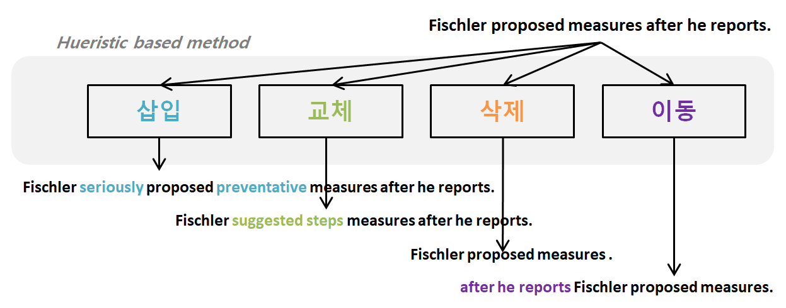
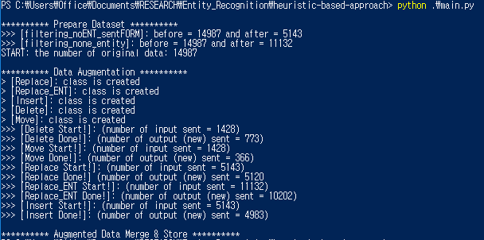

# 개체명 인식을 위한 학습 데이터  확장 연구

딥러닝과 같은 복잡한 모델의 경우 과적합 문제를 피하기 위해서 다양한 테크닉들을 사용한다. 그 중에서 학습 데이터를 늘리는 것이 가장 근본적인 해결책이 될 수 있다. 보통 수작업으로 학습 데이터를 구축하는데 많은 비용과 시간이 소요되는 단점이 있다. 따라서, 자동으로 학습 데이터를 확장할 수 있는 연구가 필요하다. 본 연구에서는 개체명 인식 문제에 사용되는 텍스트 학습 데이터를 자동으로 확장할 수 있는 알고리즘을 개발한다. 



연속적인 값을 가지는 이미지, 음성 데이터와 다르게 이산적인 값을 가지는 텍스트 데이터는 휴리스틱(로직) 기반으로 알고리즘을 설계한다. 규칙들과 언어 자원들을 사용하여 (1)교체, (2)삽입, (3)삭제, (4)이동으로 크게 4가지 알고리즘을 개발하였다. 개체명 인식을 위한 데이터 확장 연구이지만, 특정 모듈만 사용하여 문서 분류 문제에서도 사용될 수 있다 (참고: doc_class폴더에서 python main.py --doc 실행).

* 근본적인 과적합 문제의 해결책으로 풍부한 학습 데이터의 필요성
* 시간과 비용을 요구하는 수작업과 달리 자동 학습 데이터 확장 시스템의 필요성  
* 이산적 특징을 가지는 텍스트에 맞는 휴리스틱(규칙) 기반의 확장 프로세스 구축
   * 삽입: 연어 사전(collocation dict)을 활용하여 관련 단어를 추가하면서 문장을 변형
   * 교체: wordnet, word2vec, sense2vec을 활용하여 유사어를 교체하면서 문장을 변형
   * 삭제와 이동: 구문 파서를 활용하여 부사절 수식어구를 삭제 및 이동하면서 문장을 변형


본 연구의 내용은 [문서](https://1drv.ms/w/s!AllPqyV9kKUrkULe4nbvFU8Oj8j3)와 [파워포인트](https://1drv.ms/p/s!AllPqyV9kKUrkUOft37gKbgNnOIz)에 정리되어 있다. ipython_notebook 폴더에는 notebook 버전의 소스코드가 있다. 또한, 본 연구의 발표 자료는 [여기](https://1drv.ms/p/s!AllPqyV9kKUrl133BcFl2M4crEXj)에 있다.


## Prerequisites
* [spaCy](https://spacy.io/)
* [NLTK](https://www.nltk.org/)
* [Stanford Parser](https://nlp.stanford.edu/software/lex-parser.html)
* [sense2vec](https://github.com/explosion/sense2vec)
* [pdfminer](https://github.com/euske/pdfminer) (Python PDF Parser)
* [NeuroNER](https://github.com/Franck-Dernoncourt/NeuroNER) (Neural Model for NER)
* [GloVe](https://nlp.stanford.edu/projects/glove/) (pretrained word embedding; glove.6B.100d.txt)
* [Oxford Collocation Dictionary](http://www.freecollocation.com/)

## Model
* NeuroNER; a program for named entity recognition based on nueral networks [[github](https://github.com/Franck-Dernoncourt/NeuroNER)] [[web-site](http://neuroner.com/)]
* Window Model for NER [[cs224d](http://cs224d.stanford.edu/assignment2/index.html)] (참고: window_rnn_ner 폴더에서 python root.py 10(#exe) 실행)

## Dataset
* [CoNLL 2003 shared task (NER) data](https://cogcomp.org/page/resource_view/81)
* [ACE 2005 Multilingual Training Corpus](https://catalog.ldc.upenn.edu/ldc2006t06) (for entity-replace)


## Usage

### 0. **Prepare resources** <br>
* Download *Stanford Parser* in the C://
* Download *dataset* in the data/
* Download *pdfminer github* in pdfminer/
* Download *sense2vec github* in github/
* Download *Oxford Collocation Dictionary* as pdf file in the pdfminer/myDir/
* Generate *friend_list* and *voca* for insert module by executing `pdfminer.six/convert_pdf.ipynb` and locate them in resources/for_insert/
* Generate *entities* via `ipython_notebook/make entity dic.ipynb` and store them in the resources/entity_info/


### 1. **Generate Augmented Data**
* Before executing 1, fill out hyperparameters in the parameters.ini file.
```
~$ python src-aug/main.py
```
* After executing 1, change data in data/conll2003/en/.. into augmented data in the gen_data/logic/

### 2. **Execute Model** 

```
~$ python src-neuroner/root.py 10
```
* arg: number of running times



## Contribution
* 이산적 특징을 가지는 텍스트 학습 데이터를 자동으로 늘릴 수 있는 연구
* 언어 자원을 활용하여 다양한 형태의 문장을 표현하는 알고리즘 설계


## Summary
* 연속적인 수치범위를 가지는 이미지 데이터와 다르게 이산적인 수치범위를 가지는 문자 데이터를 변형하기 위해서 규칙 기반의 문자 데이터 변환기법 제안
* 연어 사전을 이용하여 문맥과 관련 있는 단어를 삽입할 수 있는 삽입 모듈 설계
* WordNet, Word Embedding과 같은 의미적인 언어 자원들을 이용하여 문맥과 관련 있는 유사어를 교체할 수 있는 교체 모듈 설계
* Parser와 같은 구문적인 언어 자원들을 이용하여 문맥에서 큰 역할을 하지 않는 수식어를 삭제하거나 이동할 수 있는 삭제와 이동 모듈 설계
* 개체명 인식 모델을 대상으로 원본과 확장된 데이터를 학습하여 성능 비교 

_Resources_
* 개체명 인식 데이터셋 정리 [[문서](https://1drv.ms/w/s!AllPqyV9kKUrkUUHOqncvjE1ZMbW)]
* 연구 아이디어 및 관련연구 정리 [[문서](https://1drv.ms/p/s!AllPqyV9kKUrkUt29nfhcEL-XRI_)]
* 연구 노트 정리 [[문서](https://1drv.ms/w/s!AllPqyV9kKUrkW9YbbtvBB_UpHVd)]
* 삽입 모듈에 사용되는 oxford collocation dictionary를 문서화하기 위하여 [pdfminer](https://github.com/euske/pdfminer) 사용 (참고: insert.ipynb)
* subset_generator.py를 통해 데이터의 subset을 만듦 (ex. 30%의 데이터셋)

## Acknowledgement
Korea Institute of Science and Technology Information (KISTI) <br>
University of Science and Technology (UST), Korea <br>
2017.07 ~ 10
